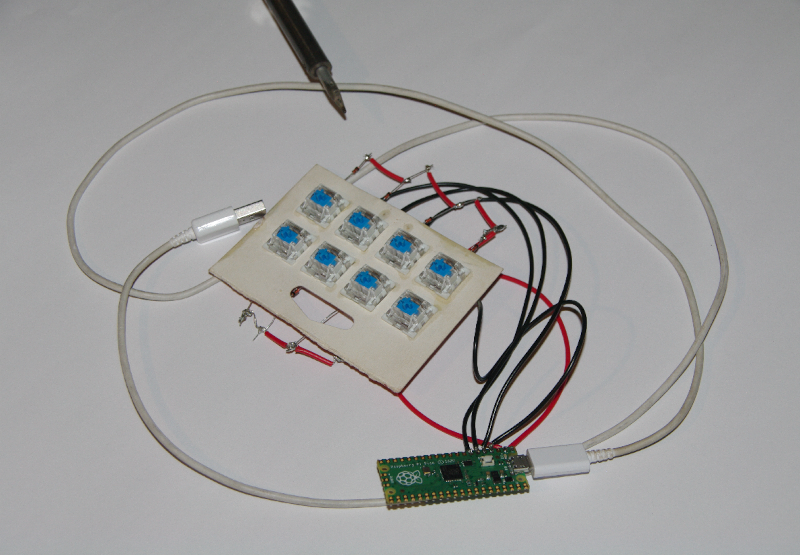

# ~~Most Valuable~~ Minimum Viable Macropad

Built this to make mistakes on a cheap and easily sourced set of components.  Succeeded in that purpose.

- Clean design
- Terrible implementation
- Tested: actually works
- Yes I used the MCU's packaging as a switch plate

